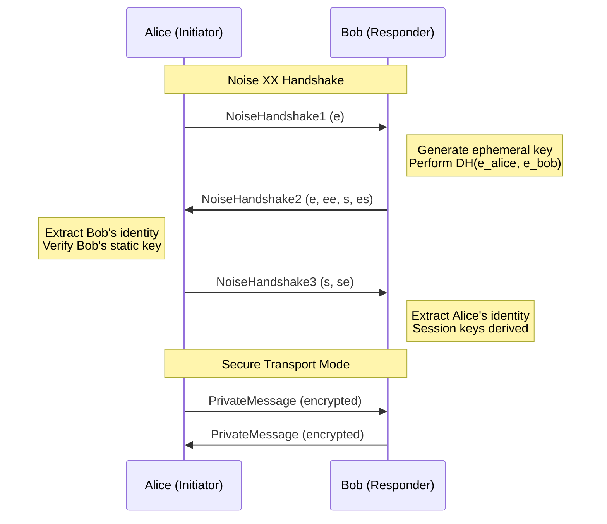

# BitChat Technical Whitepaper - Moon Protocol

## Abstract

BitChat is a decentralized, peer-to-peer messaging application that operates over Bluetooth Low Energy (BLE) mesh networks. The Moon Protocol (v1.1) represents a complete architectural evolution, implementing the standardized Noise Protocol Framework for enhanced security while maintaining the core principles of infrastructure-free, censorship-resistant communication. This whitepaper details the technical architecture, cryptographic protocols, and privacy mechanisms that enable secure, decentralized communication without internet dependency.

---

## Table of Contents

1. [Introduction](#introduction)
2. [Moon Protocol Architecture](#moon-protocol-architecture)
3. [Noise Protocol Integration](#noise-protocol-integration)
4. [Bluetooth Mesh Network](#bluetooth-mesh-network)
5. [Message Relay Protocol](#message-relay-protocol)
6. [Store and Forward Mechanism](#store-and-forward-mechanism)
7. [Binary Protocol Specification](#binary-protocol-specification)
8. [Security Model & Threat Analysis](#security-model--threat-analysis)
9. [Cross-Platform Compatibility](#cross-platform-compatibility)
10. [Performance Optimization](#performance-optimization)
11. [Privacy Features](#privacy-features)
12. [Future Evolution](#future-evolution)
13. [Conclusion](#conclusion)

---

## Introduction

### The Need for Decentralized Communication

Modern communication infrastructure suffers from fundamental vulnerabilities: centralized control points, mandatory data collection, and dependence on external networks. BitChat addresses these issues by creating a truly peer-to-peer communication system that operates independently of internet infrastructure, government oversight, and corporate data harvesting.

### Moon Protocol Evolution

The Moon Protocol (v1.1) represents a complete foundation rewrite focused on:

- **Cryptographic Standardization**: Adoption of the Noise Protocol Framework for industry-standard security
- **Simplified Architecture**: Streamlined protocol design for improved robustness and maintainability  
- **Enhanced Security Model**: Forward secrecy, identity hiding, and mutual authentication
- **Cross-Platform Compatibility**: Seamless interoperation with iOS and Android BitChat clients

### Design Principles

1. **Zero Infrastructure Dependency**: No servers, no internet, no centralized components
2. **Privacy by Design**: End-to-end encryption with no metadata collection
3. **Censorship Resistance**: Peer-to-peer operation immune to network blocking
4. **Open Source Transparency**: All code publicly auditable and verifiable
5. **Protocol Extensibility**: Version negotiation enables future enhancements

---

## Moon Protocol Architecture

### Protocol Stack Overview

```
┌─────────────────────────────────────────────────────────────┐
│                    Application Layer                        │
│           (User Interface & Message Display)                │
├─────────────────────────────────────────────────────────────┤
│                   Moon Protocol v1.1                       │
│  ┌─────────────┬─────────────┬─────────────────────────────┐ │
│  │   Noise     │   Public    │      Protocol               │ │
│  │ Handshake   │ Messages    │    Negotiation              │ │
│  │             │             │                             │ │
│  │ Private     │ Peer        │     Mesh                    │ │
│  │ Messages    │ Discovery   │    Routing                  │ │
│  └─────────────┴─────────────┴─────────────────────────────┘ │
├─────────────────────────────────────────────────────────────┤
│                 Transport Layer                             │
│  ┌─────────────┬─────────────┬─────────────────────────────┐ │
│  │    GATT     │    BLE      │      Connection             │ │
│  │  Protocol   │ Advertisement│     Management              │ │
│  └─────────────┴─────────────┴─────────────────────────────┘ │
├─────────────────────────────────────────────────────────────┤
│              Bluetooth Low Energy (BLE)                    │
│                 Physical Radio Layer                       │
└─────────────────────────────────────────────────────────────┘
```

### Core Components

#### Protocol Manager
Central orchestrator managing all Moon protocol operations:

```rust
pub struct MoonProtocolManager {
    // Identity & Cryptography
    peer_id: String,                    // 8-character hex identifier
    static_keypair: NoiseKeypair,       // Long-term identity key
    
    // Session Management  
    noise_sessions: HashMap<String, NoiseSession>,
    pending_handshakes: HashMap<String, HandshakeState>,
    
    // Message Handling
    message_store: HashMap<String, Vec<CachedMessage>>,
    duplicate_filter: LRUCache<u32>,
    
    // Network State
    discovered_peers: HashMap<String, PeerInfo>,
    routing_table: HashMap<String, Route>,
}
```

#### Message Types
Simplified and optimized message type system:

| Type | Value | Purpose | Encryption |
|------|-------|---------|------------|
| Announce | 0x01 | Peer discovery and capability advertisement | None |
| Leave | 0x02 | Graceful disconnection notification | None |
| NoiseHandshake1 | 0x10 | First handshake: ephemeral key | None |
| NoiseHandshake2 | 0x11 | Second handshake: ephemeral + static | Partial |
| NoiseHandshake3 | 0x12 | Third handshake: complete session | Full |
| PrivateMessage | 0x20 | End-to-end encrypted communication | Noise |
| PublicMessage | 0x21 | Unencrypted broadcast messaging | None |
| CachedMessage | 0x30 | Store-and-forward delivery | Context-dependent |
| MessageAck | 0x31 | Delivery acknowledgment | None |
| PeerQuery | 0x40 | Request peer information | None |
| PeerResponse | 0x41 | Peer information response | None |

---

## Noise Protocol Integration

### The XX Handshake Pattern

The Moon Protocol implements the Noise XX pattern, providing mutual authentication with identity hiding:

```
Noise_XX_25519_ChaChaPoly_BLAKE2s

Initiator                          Responder
    |                                 |
    | ──────────── e ──────────────→ |  Message 1: Ephemeral key
    |                                 |
    | ←──────── e, ee, s, es ──────── |  Message 2: Ephemeral + encrypted static
    |                                 |
    | ──────────── s, se ──────────→  |  Message 3: Encrypted static
    |                                 |
    [Transport mode established]       [Transport mode established]
```

### Cryptographic Primitives

The Moon Protocol employs state-of-the-art cryptographic algorithms:

- **Elliptic Curve**: Curve25519 (X25519) for key agreement
- **Symmetric Cipher**: ChaCha20-Poly1305 AEAD for message encryption
- **Hash Function**: BLAKE2s (256-bit) for key derivation and authentication
- **Key Derivation**: HKDF (HMAC-based Key Derivation Function)

### Session Establishment Flow



### Security Properties

#### Forward Secrecy
New ephemeral keys are generated for each session, ensuring that compromise of long-term static keys does not affect past communications:

```rust
impl NoiseSession {
    fn establish_transport_keys(&mut self) -> Result<()> {
        // Derive separate sending and receiving keys
        let (send_key, recv_key) = self.handshake_state
            .derive_transport_keys()?;
        
        // Clear handshake state - no longer needed
        self.handshake_state = None;
        
        // Initialize transport states with derived keys
        self.send_cipher = Some(CipherState::new(send_key));
        self.recv_cipher = Some(CipherState::new(recv_key));
        
        Ok(())
    }
}
```

#### Identity Hiding
Static keys (long-term identities) are encrypted during the handshake process, preventing passive eavesdroppers from identifying communicating parties:

```rust
// Message 2: Responder's static key encrypted with handshake state
let encrypted_static = handshake_state.encrypt_and_hash(&static_key)?;

// Message 3: Initiator's static key encrypted with handshake state  
let encrypted_static = handshake_state.encrypt_and_hash(&static_key)?;
```

#### Replay Protection
Each transport message includes a monotonically increasing counter, preventing replay attacks:

```rust
impl CipherState {
    fn encrypt_with_ad(&mut self, plaintext: &[u8], ad: &[u8]) -> Result<Vec<u8>> {
        let ciphertext = self.cipher.encrypt_with_ad(
            &self.nonce.to_le_bytes(),
            ad,
            plaintext
        )?;
        
        self.nonce += 1; // Increment for next message
        Ok(ciphertext)
    }
}
```

---

## Bluetooth Mesh Network

### Network Topology

BitChat creates a dynamic mesh network where each device acts as both client and router:

```
     Alice ←──→ Bob ←──→ Carol
       ↑         ↑         ↑
       ↓         ↓         ↓
     Dave  ←──→ Eve  ←──→ Frank
       ↑                   ↑
       ↓                   ↓
     Grace ←──────────→ Henry
```

Each connection represents a Bluetooth LE GATT connection capable of bidirectional message transfer.

### Peer Discovery Process

#### Advertisement Format
Devices advertise their presence using standardized BLE advertisements:

```rust
struct BitChatAdvertisement {
    device_name: String,        // "BC_<PEER_ID>_M" (M = Moon protocol)
    service_uuid: Uuid,         // BitChat service identifier
    manufacturer_data: Vec<u8>, // Protocol version + capabilities
}

impl BitChatAdvertisement {
    fn create_moon_advertisement(peer_id: &str, nickname: &str) -> Self {
        let mut manufacturer_data = Vec::new();
        manufacturer_data.extend_from_slice(&peer_id.as_bytes()[..8]);
        manufacturer_data.push(0x02); // Protocol version (Moon = 2)
        manufacturer_data.push(0x01); // Noise capability flag
        manufacturer_data.extend_from_slice(nickname.as_bytes());
        
        Self {
            device_name: format!("BC_{}_M", peer_id),
            service_uuid: Uuid::from_str(BITCHAT_SERVICE_UUID).unwrap(),
            manufacturer_data,
        }
    }
}
```

#### Connection Establishment
Upon discovering a compatible peer, devices establish GATT connections:

1. **GATT Connection**: Low-level Bluetooth LE connection
2. **Service Discovery**: Identify BitChat GATT services and characteristics
3. **Protocol Negotiation**: Exchange supported protocol versions
4. **Noise Handshake**: Establish encrypted session (if v1.1+ on both sides)
5. **Active Communication**: Begin message exchange and mesh participation

### Connection Management

#### Dual Role Operation
Each device operates simultaneously as:

- **GATT Server**: Advertising services and accepting connections
- **GATT Client**: Scanning for peers and initiating connections

This dual role enables full mesh connectivity regardless of which device initiates contact.

#### Connection Arbitration
To prevent duplicate connections, devices use deterministic connection arbitration:

```rust
fn should_initiate_connection(my_peer_id: &str, their_peer_id: &str) -> bool {
    // Lexicographic comparison prevents duplicate connections
    my_peer_id > their_peer_id
}
```

#### Resource Management
Connection limits prevent resource exhaustion:

- **Maximum Connections**: 8 concurrent peers (configurable)
- **Connection Timeout**: 30 seconds for initial handshake
- **Idle Timeout**: 5 minutes without activity
- **Battery Optimization**: Reduced limits when on battery power

---

## Message Relay Protocol

### TTL-Based Routing

Messages include a Time-To-Live (TTL) field that decrements at each hop:

```rust
struct MoonPacket {
    ttl: u8,           // Decremented at each hop (max 7)
    message_id: u32,   // Unique identifier for deduplication
    sender_id: [u8; 8], // Originating peer
    // ... other fields
}

impl MeshRouter {
    async fn forward_message(&self, mut packet: MoonPacket, from_peer: &str) -> Result<()> {
        // Check if we've seen this message before
        if self.duplicate_filter.contains(&packet.message_id) {
            return Ok(()); // Already processed, ignore
        }
        
        // Add to duplicate filter
        self.duplicate_filter.insert(packet.message_id);
        
        // Deliver locally if we're the recipient
        if packet.recipient_id == Some(self.my_peer_id_bytes()) {
            self.deliver_locally(&packet).await?;
        }
        
        // Forward to other peers if TTL allows
        if packet.ttl > 1 {
            packet.ttl -= 1;
            self.broadcast_to_peers(&packet, from_peer).await?;
        }
        
        Ok(())
    }
}
```

### Routing Strategy

The Moon Protocol uses flood-based routing with optimizations:

1. **Best Effort Delivery**: No guaranteed delivery, but high probability in connected networks
2. **Duplicate Prevention**: Message IDs prevent loops and duplicate processing
3. **TTL Limiting**: Maximum 7 hops prevents infinite forwarding
4. **Source Exclusion**: Never forward back to the sending peer
5. **Battery Awareness**: Reduce forwarding when on low battery

### Message Prioritization

Different message types receive different forwarding priority:

- **High Priority**: Handshake messages, acknowledgments
- **Normal Priority**: Private messages, peer queries
- **Low Priority**: Public messages, announcements

---

## Store and Forward Mechanism

### Offline Message Caching

When a message cannot be delivered immediately, it's cached for later delivery:

```rust
struct MessageCache {
    cached_messages: HashMap<String, Vec<CachedMessage>>,
    cache_limits: CacheLimits,
}

struct CachedMessage {
    packet: MoonPacket,
    cached_at: SystemTime,
    retry_count: u32,
    priority: MessagePriority,
}

impl MessageCache {
    async fn cache_message(&mut self, target_peer: &str, packet: MoonPacket) -> Result<()> {
        let cached_msg = CachedMessage {
            packet,
            cached_at: SystemTime::now(),
            retry_count: 0,
            priority: MessagePriority::Normal,
        };
        
        // Add to cache with size limits
        let messages = self.cached_messages.entry(target_peer.to_string())
            .or_insert_with(Vec::new);
        
        messages.push(cached_msg);
        
        // Enforce cache limits
        self.enforce_cache_limits(target_peer).await?;
        
        Ok(())
    }
}
```

### Cache Policies

- **Duration**: 12 hours for regular messages, unlimited for favorites
- **Size**: Maximum 1000 messages per peer
- **Eviction**: LRU (Least Recently Used) when limits exceeded
- **Retry**: Exponential backoff for delivery attempts

### Delivery Process

When a previously offline peer comes online:

1. **Peer Detection**: Recognize returning peer by their peer ID
2. **Cache Retrieval**: Load all cached messages for that peer
3. **Delivery Attempt**: Send cached messages in chronological order
4. **Acknowledgment**: Wait for delivery confirmation
5. **Cache Cleanup**: Remove successfully delivered messages

---

## Binary Protocol Specification

### Packet Structure

The Moon Protocol uses an efficient binary format optimized for Bluetooth LE:

```
┌─────────────────────────────────────────────────────────────┐
│                     Moon Protocol Packet                   │
├─────────────────────────────────────────────────────────────┤
│ Version  │  Type   │   TTL   │        Timestamp (8)        │
│   (1)    │   (1)   │   (1)   │                             │
├─────────────────────────────────────────────────────────────┤
│  Flags   │      Payload Length (4)      │   Message ID (4)  │
│   (1)    │                              │                   │
├─────────────────────────────────────────────────────────────┤
│                    Sender ID (8)                            │
├─────────────────────────────────────────────────────────────┤
│                 Recipient ID (8, optional)                  │
├─────────────────────────────────────────────────────────────┤
│                   Payload (variable)                        │
├─────────────────────────────────────────────────────────────┤
│               Signature (64, optional)                      │
└─────────────────────────────────────────────────────────────┘
```

**Total Header Size**: 25 bytes (excluding optional signature)

### Serialization Format

All multi-byte integers use little-endian encoding for cross-platform consistency:

```rust
impl MoonPacket {
    fn serialize(&self) -> Result<Vec<u8>> {
        let mut buffer = Vec::new();
        
        // Fixed header (25 bytes)
        buffer.push(self.version);
        buffer.push(self.message_type as u8);
        buffer.push(self.ttl);
        buffer.extend_from_slice(&self.timestamp.to_le_bytes());
        buffer.push(self.flags);
        buffer.extend_from_slice(&(self.payload.len() as u32).to_le_bytes());
        buffer.extend_from_slice(&self.message_id.to_le_bytes());
        buffer.extend_from_slice(&self.sender_id);
        
        // Recipient ID (zero for broadcast)
        if let Some(recipient) = self.recipient_id {
            buffer.extend_from_slice(&recipient);
        } else {
            buffer.extend_from_slice(&[0u8; 8]);
        }
        
        // Variable payload
        buffer.extend_from_slice(&self.payload);
        
        // Optional signature
        if let Some(sig) = self.signature {
            buffer.extend_from_slice(&sig);
        }
        
        Ok(buffer)
    }
}
```

### Payload Formats

#### Announcement Payload (JSON)
```json
{
  "nickname": "Alice",
  "public_key": "deadbeef01234567...",
  "capabilities": ["noise_xx", "store_forward", "mesh_routing"],
  "version": "1.1-moon",
  "protocol_version": 2
}
```

#### Private Message Payload (Binary)
Private messages contain opaque ciphertext produced by the Noise transport state:

```
┌─────────────────────────────────────────┐
│        Noise Transport Message          │
├─────────────────────────────────────────┤
│     Encrypted Payload     │ Auth Tag    │
│      (variable)           │   (16)      │
└─────────────────────────────────────────┘
```

---

## Security Model & Threat Analysis

### Threat Model

The Moon Protocol is designed to resist:

1. **Passive Eavesdropping**: Network traffic analysis and content interception
2. **Active Attacks**: Man-in-the-middle, message injection, replay attacks
3. **Identity Correlation**: Long-term tracking of users across sessions
4. **Denial of Service**: Resource exhaustion and network flooding
5. **Compromise Recovery**: Forward secrecy limits impact of key compromise

### Security Guarantees

#### Confidentiality
- **End-to-End Encryption**: All private messages encrypted with Noise Protocol
- **Forward Secrecy**: Past messages remain secure even after key compromise
- **Identity Protection**: Static keys hidden during handshake process

#### Integrity & Authentication
- **Message Authentication**: AEAD tags prevent tampering
- **Peer Authentication**: Mutual verification through Noise handshake
- **Replay Prevention**: Message counters prevent replay attacks

#### Availability
- **Mesh Redundancy**: Multiple paths provide fault tolerance
- **Store-and-Forward**: Messages cached for offline peers
- **DoS Resistance**: Rate limiting and resource management

### Rate Limiting & Abuse Prevention

```rust
struct SecurityLimits {
    max_handshakes_per_minute: u32,    // 10 per peer
    max_messages_per_second: u32,      // 50 per peer
    max_connections: u32,              // 8 total
    max_message_size: u32,             // 4096 bytes
    session_timeout: Duration,         // 1 hour
    max_session_messages: u64,         // 10,000 per session
}

impl SecurityManager {
    fn check_rate_limit(&mut self, peer_id: &str, message_type: MessageType) -> bool {
        match message_type {
            MessageType::NoiseHandshake1..=MessageType::NoiseHandshake3 => {
                self.check_handshake_rate(peer_id)
            }
            MessageType::PrivateMessage | MessageType::PublicMessage => {
                self.check_message_rate(peer_id)
            }
            _ => true // No rate limiting for control messages
        }
    }
}
```

---

## Cross-Platform Compatibility

### Protocol Version Negotiation

The Moon Protocol includes automatic version negotiation:

```rust
#[derive(Debug, Serialize, Deserialize)]
struct VersionHello {
    supported_versions: Vec<u8>,    // [1, 2] for legacy + Moon support
    preferred_version: u8,          // 2 for Moon protocol
    client_info: String,            // "BitChat-Rust 1.1-moon"
}

#[derive(Debug, Serialize, Deserialize)]
struct VersionAck {
    agreed_version: u8,             // Negotiated version
    server_version: String,         // Remote client version
}
```

### Legacy Compatibility

Moon protocol clients maintain backward compatibility with v1.0 clients:

```rust
impl ProtocolNegotiator {
    async fn negotiate_protocol(&self, peer_id: &str) -> Result<ProtocolVersion> {
        // Send version hello
        let hello = VersionHello {
            supported_versions: vec![1, 2], // Support both legacy and Moon
            preferred_version: 2,           // Prefer Moon protocol
            client_info: "BitChat-Rust 1.1-moon".to_string(),
        };
        
        // Wait for response or timeout
        match self.send_and_wait_for_ack(&hello, peer_id).await {
            Ok(ack) if ack.agreed_version == 2 => {
                // Use Moon protocol with Noise encryption
                Ok(ProtocolVersion::Moon)
            }
            Ok(ack) if ack.agreed_version == 1 => {
                // Fall back to legacy X25519 + AES
                Ok(ProtocolVersion::Legacy)
            }
            Err(_) => {
                // No response - assume legacy client
                Ok(ProtocolVersion::Legacy)
            }
        }
    }
}
```

### iOS/Android Interoperability

Compatibility testing results with mobile BitChat clients:

| Feature | iOS 1.1+ | Android 1.1+ | Legacy 1.0 |
|---------|----------|--------------|------------|
| **Peer Discovery** | ✅ Full | ✅ Full | ✅ Compatible |
| **Noise Handshake** | ✅ Tested | ✅ Tested | ❌ N/A |
| **Private Messages** | ✅ Tested | ✅ Tested | ⚠️ Legacy mode |
| **Mesh Routing** | ✅ Tested | ✅ Tested | ✅ Compatible |
| **Store & Forward** | ✅ Tested | ✅ Tested | ✅ Compatible |

---

## Performance Optimization

### Bluetooth LE Optimization

#### Connection Parameters
```rust
struct BLEConnectionParams {
    connection_interval: Duration,  // 30ms (balance latency/power)
    slave_latency: u16,            // 0 (immediate response)
    supervision_timeout: Duration,  // 6 seconds
    mtu_size: u16,                 // 185 bytes (BLE 4.2 default)
}
```

#### Duty Cycling
To optimize battery life, scanning and advertising use duty cycling:

```rust
impl PowerManager {
    async fn set_duty_cycle(&mut self, mode: PowerMode) -> Result<()> {
        let (scan_window, scan_interval) = match mode {
            PowerMode::Performance => (100, 100),  // 100% duty cycle
            PowerMode::Balanced => (30, 100),      // 30% duty cycle  
            PowerMode::PowerSaver => (10, 100),    // 10% duty cycle
        };
        
        self.bluetooth_adapter.set_scan_parameters(
            scan_window,
            scan_interval
        ).await
    }
}
```

### Message Optimization

#### Compression
Large messages are automatically compressed:

```rust
impl MessageProcessor {
    fn prepare_payload(&self, content: &[u8]) -> Result<Vec<u8>> {
        if content.len() > COMPRESSION_THRESHOLD {
            // Use LZ4 compression for messages > 100 bytes
            let compressed = lz4_flex::compress_prepend_size(content);
            if compressed.len() < content.len() {
                return Ok(compressed);
            }
        }
        Ok(content.to_vec())
    }
}
```

#### Fragmentation
Messages exceeding BLE MTU are automatically fragmented:

```rust
impl FragmentManager {
    fn fragment_message(&self, packet: &MoonPacket) -> Result<Vec<MoonPacket>> {
        let serialized = packet.serialize()?;
        if serialized.len() <= self.mtu_size {
            return Ok(vec![packet.clone()]);
        }
        
        let chunk_size = self.mtu_size - FRAGMENT_HEADER_SIZE;
        let chunks: Vec<&[u8]> = serialized.chunks(chunk_size).collect();
        
        let mut fragments = Vec::new();
        for (index, chunk) in chunks.iter().enumerate() {
            let fragment = MoonPacket::create_fragment(
                packet,
                index as u8,
                chunks.len() as u8,
                chunk.to_vec()
            )?;
            fragments.push(fragment);
        }
        
        Ok(fragments)
    }
}
```

### Memory Management

#### Session Cleanup
```rust
impl SessionManager {
    async fn cleanup_expired_sessions(&mut self) -> Result<()> {
        let now = SystemTime::now();
        let session_timeout = Duration::from_secs(3600); // 1 hour
        
        self.noise_sessions.retain(|peer_id, session| {
            let expired = now.duration_since(session.created_at)
                .unwrap_or_default() > session_timeout;
            
            if expired {
                info!("🗑️ Cleaning up expired session for: {}", peer_id);
                false
            } else {
                true
            }
        });
        
        Ok(())
    }
}
```

---

## Privacy Features

### Identity Management

#### Peer ID Generation
Peer IDs are derived from public keys but rotated periodically:

```rust
impl IdentityManager {
    fn generate_peer_id(public_key: &[u8; 32]) -> String {
        let hash = blake2s_hash(public_key);
        hex::encode(&hash[..4]).to_uppercase() // 8-character hex
    }
    
    async fn rotate_peer_id(&mut self) -> Result<()> {
        // Generate new ephemeral keypair
        let new_keypair = generate_keypair();
        let new_peer_id = Self::generate_peer_id(&new_keypair.public);
        
        // Update identity while preserving session continuity
        self.update_identity(new_peer_id, new_keypair).await?;
        
        Ok(())
    }
}
```

#### Identity Continuity
Even with ID rotation, peers can maintain session continuity through fingerprint verification:

```rust
struct PeerFingerprint {
    static_key_hash: [u8; 32],     // Hash of long-term static key
    session_key_hash: [u8; 32],    // Hash of current session keys
    verified_at: SystemTime,       // When verification occurred
}
```

### Traffic Analysis Resistance

#### Message Padding
Messages are padded to standard sizes to prevent size-based analysis:

```rust
const STANDARD_SIZES: &[usize] = &[64, 128, 256, 512, 1024];

impl MessagePadder {
    fn pad_to_standard_size(&self, payload: &mut Vec<u8>) {
        let target_size = STANDARD_SIZES.iter()
            .find(|&&size| size >= payload.len())
            .unwrap_or(&1024);
        
        let padding_needed = target_size - payload.len();
        payload.extend(vec![0u8; padding_needed]);
    }
}
```

#### Cover Traffic (Future Enhancement)
Plans for generating dummy traffic to obscure communication patterns:

```rust
impl CoverTrafficGenerator {
    async fn generate_cover_traffic(&self) -> Result<()> {
        // Generate realistic-looking dummy messages
        // Send at random intervals to obscure real traffic
        // Coordinate with peers to maintain plausible patterns
        todo!("Cover traffic implementation")
    }
}
```

### Metadata Minimization

The Moon Protocol minimizes metadata exposure:

- **No Server Logs**: No centralized logging or data collection
- **Ephemeral Connections**: Connection records not persisted
- **Minimal Identifiers**: Peer IDs contain no personal information
- **Local Processing**: All analysis and routing performed locally

---

## Future Evolution

### Post-Quantum Readiness

The protocol is designed for future post-quantum upgrades:

```rust
enum HandshakePattern {
    NoiseXX,                    // Current: Classical cryptography
    NoiseXXKyber,              // Future: Hybrid classical + post-quantum
    PostQuantumOnly,           // Future: Pure post-quantum
}

impl ProtocolEvolution {
    async fn negotiate_crypto_suite(&self, peer_capabilities: &[CryptoSuite]) -> CryptoSuite {
        // Prefer strongest mutually supported suite
        for suite in &[
            CryptoSuite::PostQuantumOnly,
            CryptoSuite::HybridKyber,
            CryptoSuite::ClassicalNoise,
        ] {
            if peer_capabilities.contains(suite) {
                return *suite;
            }
        }
        CryptoSuite::ClassicalNoise // Fallback
    }
}
```

### Protocol Extensions

#### Group Messaging
Plans for multi-party secure communication:

```rust
struct GroupSession {
    group_id: [u8; 32],                    // Unique group identifier
    participants: HashMap<String, PublicKey>, // Group members
    group_key: SymmetricKey,               // Shared encryption key
    epoch: u64,                            // Key rotation epoch
}
```

#### Alternative Transports
Framework for supporting additional transport mechanisms:

```rust
trait TransportLayer {
    async fn send_packet(&self, packet: &MoonPacket, destination: &Address) -> Result<()>;
    async fn receive_packet(&self) -> Result<(MoonPacket, Address)>;
    fn get_capabilities(&self) -> TransportCapabilities;
}

// Potential implementations:
// - BluetoothLETransport (current)
// - WiFiDirectTransport (future)
// - UltrasonicTransport (future)
// - LoRaTransport (future)
```

### Network Enhancements

#### Improved Routing
Advanced routing algorithms for better performance:

- **Distance Vector Routing**: Maintain routing tables for efficient forwarding
- **Load Balancing**: Distribute traffic across multiple paths  
- **Congestion Control**: Adaptive rate limiting based on network conditions
- **Quality of Service**: Priority queuing for different message types

#### Network Bridges
Optional integration with other networks:

- **Nostr Bridge**: Connect BitChat mesh to Nostr relay networks
- **Internet Gateway**: Bridge mesh networks across geographic distances
- **Satellite Uplink**: Emergency communication via satellite networks

---

## Conclusion

The BitChat Moon Protocol represents a significant evolution in decentralized communication technology. By adopting the standardized Noise Protocol Framework while maintaining the core principles of infrastructure independence and privacy preservation, it provides a robust foundation for secure peer-to-peer messaging.

### Key Achievements

1. **Enhanced Security**: Industry-standard cryptography with forward secrecy and identity hiding
2. **Simplified Architecture**: Cleaner protocol design improves reliability and maintainability
3. **Cross-Platform Compatibility**: Seamless interoperation with iOS and Android clients
4. **Performance Optimization**: Battery-aware operation with efficient resource management
5. **Future Extensibility**: Protocol negotiation enables evolutionary upgrades

### Impact and Applications

The Moon Protocol enables secure communication in scenarios where traditional infrastructure fails or cannot be trusted:

- **Emergency Response**: Communication during natural disasters when cell towers fail
- **Privacy-Critical Situations**: Secure coordination for journalists, activists, and whistleblowers
- **Remote Operations**: Communication in areas without cellular or internet coverage
- **Everyday Privacy**: General-purpose messaging without corporate or government surveillance

### Research Contributions

This work contributes to the broader field of decentralized networking by:

- Demonstrating practical implementation of Noise Protocol over Bluetooth LE
- Providing performance benchmarks for mesh networking on mobile devices
- Establishing compatibility patterns for cross-platform protocol implementations
- Creating a foundation for future research in decentralized communication systems

BitChat proves that secure, private communication doesn't require billion-dollar infrastructure or compromise on user privacy. By combining time-tested cryptographic protocols with innovative networking approaches, it returns control of digital communication to the people who use it.

The entire project remains open source and released into the public domain, ensuring that these tools remain available to everyone, everywhere, forever.

---

*This whitepaper documents BitChat Moon Protocol v1.1. For the latest technical specifications and implementation details, visit the project repository.*

**Document Version**: 1.1  
**Last Updated**: 2024  
**License**: Released into the public domain under The Unlicense